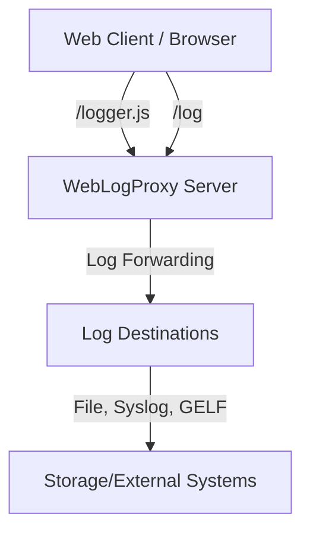
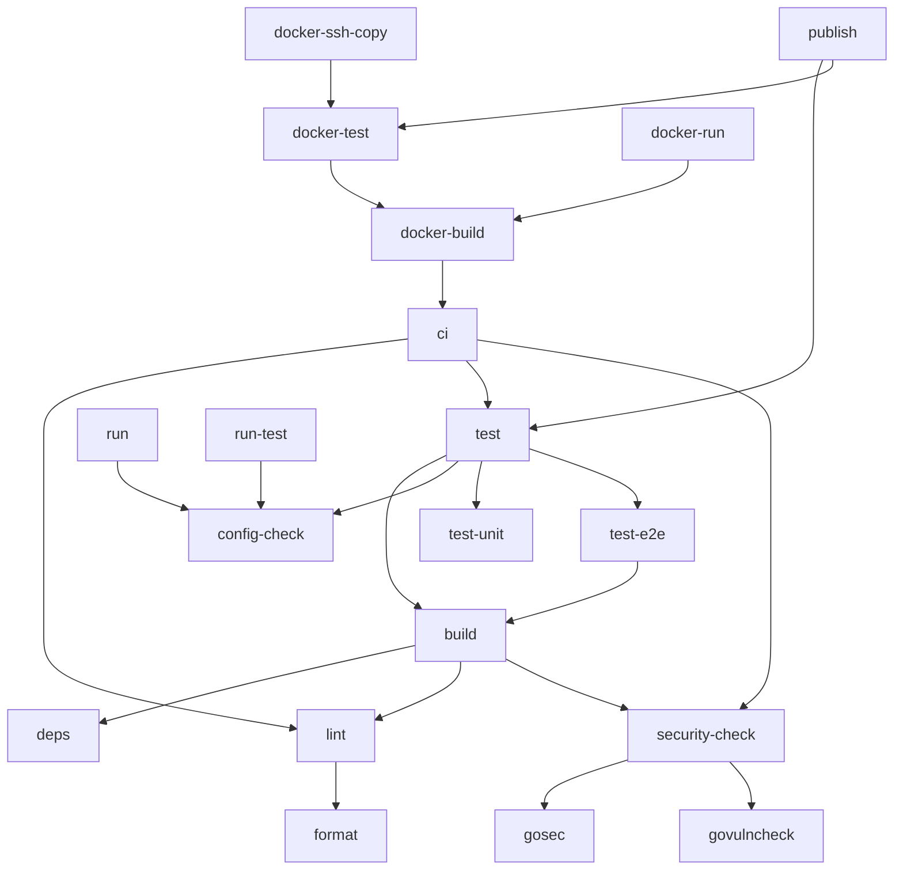

# WebLogProxy

[➡️ See CHANGELOG.md for recent changes](./CHANGELOG.md)

WebLogProxy is a flexible and secure web logging proxy that allows you to collect and forward client-side logs from web applications to various destinations.

## Features

* **Multiple Logging Destinations**: Configure multiple destinations for logs, including files, syslog servers, and GELF endpoints.
* **Rule-based Logging**: Define rules based on site ID, GTM ID, user agent, and client IP to control logging behavior.
* **Script Injection**: Inject scripts based on rules, even when logging is disabled.
* **Data Enrichment**: Add or modify log data with values from various sources (static, HTTP headers, query parameters, post data).
* **Security**: Secure token generation and validation with configurable expiration.
* **Rate Limiting**: Protect against abuse with configurable rate limits.
* **Flexible Deployment**: Run as a standalone server or embedded behind a reverse proxy.
* **CORS Support**: Configure CORS for cross-origin requests.
* **Minimal Footprint**: Built in Go for speed and efficiency, with a small memory footprint.

## Quick Start

### Using Docker

```bash
# Clone the repository
git clone https://github.com/orgoj/weblogproxy.git
cd weblogproxy

# Copy and edit the configuration file
cp config/example.yaml config/config.yaml
# Edit config/config.yaml to your needs

# Build and run with Docker
docker-compose up -d
```

### Docker Usage with Custom UID/GID

By default, the Docker container runs with a non-root user with UID/GID 1000. You can customize this by setting environment variables:

```bash
# Run with specific UID/GID (replace 1001/1001 with your values)
docker run -p 8080:8080 -e PUID=1001 -e PGID=1001 weblogproxy:latest

# Run as the current user
docker run -p 8080:8080 -e PUID=$(id -u) -e PGID=$(id -g) weblogproxy:latest
```

#### Using docker-compose (add to docker-compose.yml)
```yaml
environment:
  - PUID=1001
  - PGID=1001
```

This is useful for:
- Matching permissions with the host user for mounted volumes
- Running the application with the same permissions as the host user
- Ensuring logs and config files are owned by the appropriate user

### Building from Source

```bash
# Clone the repository
git clone https://github.com/orgoj/weblogproxy.git
cd weblogproxy

# Build the application
go build -o weblogproxy ./cmd/weblogproxy

# Copy and edit the configuration file
cp config/example.yaml config/config.yaml
# Edit config/config.yaml to your needs

# Run the application
./weblogproxy --config config/config.yaml
```

## Configuration

WebLogProxy is configured through a YAML configuration file. The file is divided into sections that control the server, security settings, log destinations, and log rules.

Create a new configuration file based on the example:

```bash
cp config/example.yaml config/config.yaml
```

### Server Configuration

```yaml
server:
  host: "0.0.0.0"  # Listen on all interfaces
  port: 8080
  mode: "standalone"  # standalone or embedded
  domain: "log.example.com"  # Required for standalone mode
  path_prefix: ""  # Required for embedded mode
  # Add other server settings as needed (CORS, headers, etc.)
```

## API Endpoints

The server provides the following endpoints:

* **GET /logger.js**: Returns a JavaScript for client-side logging. Requires `site_id` parameter, optional `gtm_id`.
* **POST /log**: Receives log data from the client. Requires a valid token from /logger.js.
* **GET /health**: Simple health check endpoint.

## /logger.js Endpoint

The `/logger.js` endpoint is the entry point for the logging system. It returns a JavaScript file that sets up the logging infrastructure in the client's browser. The returned JavaScript has two possible behaviors:

* **When Logging is Enabled**: Returns a full-featured JavaScript that includes a token, configured log URL, and all necessary functionality for logging and script injection.

* **When Logging is Disabled**: Returns a JavaScript with a no-op function that silently ignores all calls, without any configuration object.

* **Script Injection**: Always includes the scripts configured in matching rules, even when logging is disabled. This allows for injecting tracking or other scripts independently of the logging functionality.

The logger operates invisibly in the browser with no console output, ensuring quiet operation even in production environments.

## HTML Usage Example

To use WebLogProxy in your HTML, include the following script and call the `window.wlp.log` function to log events:

```html
<script src="https://yourdomain.com/logger.js?site_id=example.com"></script>
<script>
    // Example log event
    window.wlp.log({
        event: 'button_click',
        buttonId: 'logButton',
    });
</script>
```

In this example, the `logger.js` script is included, and the `window.wlp.log` function is called to log an event. The event data is sent to the WebLogProxy server.

## Log File Format

The log format follows the [Bunyan](https://github.com/trentm/node-bunyan) specification. Bunyan is a simple and fast JSON logging library for Node.js services.

### Core Fields

Every log record is a JSON object with the following required fields:

- `"v"`: Integer. Bunyan log format version (currently 0). Added by Bunyan, cannot be overridden.
- `"name"`: String. Logger name. Must be specified when creating the logger.
- `"hostname"`: String. Hostname of the machine. Retrieved via os.hostname() if not specified.
- `"pid"`: Integer. Process ID. Filled in automatically.
- `"level"`: Integer. Log level (see below). Added by Bunyan, cannot be overridden.
- `"time"`: String. ISO 8601 timestamp in UTC. Added by Bunyan, can be overridden.
- `"msg"`: String. Log message. Required for every log call.

### Log Levels

Bunyan uses the following numeric log levels:

- `10`: TRACE
- `20`: DEBUG
- `30`: INFO
- `40`: WARN
- `50`: ERROR
- `60`: FATAL

### Optional Fields

- `"src"`: Object. Source code location info. Added automatically if "src: true" is configured. Not recommended for production use.
- `"err"`: Object. Error object with stack trace.
- `"req"`: Object. HTTP request details.
- `"res"`: Object. HTTP response details.

### Example JSON Format

```json
{
  "v": 0,
  "name": "weblogproxy",
  "hostname": "server1",
  "pid": 12345,
  "level": 30,
  "time": "2024-03-14T12:34:56.789Z",
  "msg": "Processing request",
  "site_id": "site1",
  "user_id": "user123"
}
```

### Text Format

For human-readable logs, the text format follows this pattern:

```
[2024-03-14T12:34:56.789Z] INFO: Processing request (site_id=site1, user_id=user123)
```

For viewing and analyzing log files, we recommend using [lnav](https://lnav.org/), a powerful log file navigator that provides:
- Syntax highlighting for JSON
- Automatic log format detection
- SQL-like querying capabilities
- Timeline view
- Search and filtering

Example usage with lnav:
```bash
# View logs in real-time
lnav -f /path/to/log/*.log

# Search for specific events
lnav -c ':filter-in msg =~ "error"'

# Query logs using SQL
lnav -c ':sql SELECT time, msg FROM log WHERE level >= 50'
```

## Rule Processing Logic

The rule processor follows these key principles:

1. Rules are processed in order from first to last
2. Disabled rules are completely skipped
3. Rules with `continue: true`:
   - Only accumulate values (scripts, addLogData)
   - Do NOT affect logging decision
   - Do NOT affect target destinations
4. Rules with `continue: false` (or not set):
   - If enabled and matching, determine final logging decision
   - Set target destinations
   - Stop further rule processing
5. If no enabled non-continue rule matches:
   - Logging is disabled (`ShouldLogToServer: false`)
   - No target destinations are set
   - Accumulated values from continue rules are still available

## Architecture Overview



- **Web Client**: Loads logger.js and sends logs via HTTP.
- **WebLogProxy Server**: Handles log ingestion, rule processing, enrichment, security, and forwards logs.
- **Log Destinations**: Configurable outputs (file, syslog, GELF, etc.).

## Security Features

WebLogProxy implements several security mechanisms:

- **Token-based Authentication**: Each client receives a signed token via `/logger.js`, which must be included in log requests. Tokens have configurable expiration and are validated on the server.
- **Input Validation**: All incoming data is validated and sanitized to prevent injection and malformed data.
- **Rate Limiting**: Configurable rate limits per client/IP to prevent abuse and DoS attacks.
- **CORS Configuration**: Only allowed origins can access the logging endpoints, configurable via YAML.
- **Error Handling & Logging**: All errors are logged with context for audit and debugging.
- **Separation of Destinations**: Logs can be routed to different destinations, isolating sensitive data if needed.

## Development

### Mise Tasks

This project uses [Mise](https://mise.jdx.dev/) for task automation. Below is a list of all available tasks, their descriptions, and a dependency graph. Use these tasks to build, test, lint, and manage the project efficiently.

#### Task List (Alphabetical)

| Task Name             | Description                                      |
|----------------------|--------------------------------------------------|
| build                | Build the weblogproxy binary executable          |
| ci                   | Run all CI checks (lint, test, security)         |
| config-check         | Validate application configuration file          |
| deps                 | Download and tidy Go dependencies                |
| docker-build         | Build the Docker image                           |
| docker-run           | Run the Docker container                         |
| docker-ssh-copy      | Deploy Docker image to remote server via SSH      |
| docker-test          | Test Docker image and functionality              |
| format               | Format all Go code recursively                   |
| gosec                | Run gosec security scan                          |
| govulncheck          | Run govulncheck vulnerability scan               |
| install-sec-tools    | Install or update security tools (gosec, govulncheck) |
| lint                 | Run Go linters                                   |
| publish              | Publish a new version                            |
| run                  | Run weblogproxy with example configuration       |
| run-test             | Run weblogproxy with test configuration          |
| security-check       | Run all security checks                          |
| test                 | Run all tests                                    |
| test-e2e             | Run end-to-end tests only                        |
| test-unit            | Run unit tests only                              |
| version-bump-dev     | Set version to -dev and prepare [Unreleased] changelog section |
| version-bump-release | Bump version for release and update changelog    |

#### Task Dependency Graph




## Versioning and Release Process

WebLogProxy uses a two-phase versioning process:

- **Development version:**
  - Run `mise run version-bump-dev`.
  - Sets the version with the `-dev` suffix (e.g., `1.2.3-dev`) in `internal/version/version.go`.
  - Prepares the `[Unreleased]` section in `CHANGELOG.md`.
  - All builds and Docker images will be marked as dev.

- **Release version:**
  - Run `mise run version-bump-release -- -y patch` (or `minor`/`major`).
  - Removes the `-dev` suffix from the version, moves the contents of `[Unreleased]` to a new section with the version number and date in the changelog.
  - All builds and Docker images will be marked as release.

This ensures it is always clear whether a build is a development or production build. Everything is fully automated and reflected in the changelog and the `/version` API.

## Contributing

Contributions are welcome! Please open an issue or submit a pull request.

## License

This project is licensed under the MIT License - see the LICENSE file for details.

## Origin of the Program

WebLogProxy was created because I needed to log events from Google Tag 
Manager. I developed the entire project using the Cursor IDE, without 
any prior experience in the Go programming language. I didn't write a 
single line of code and was just learning to use the editor.