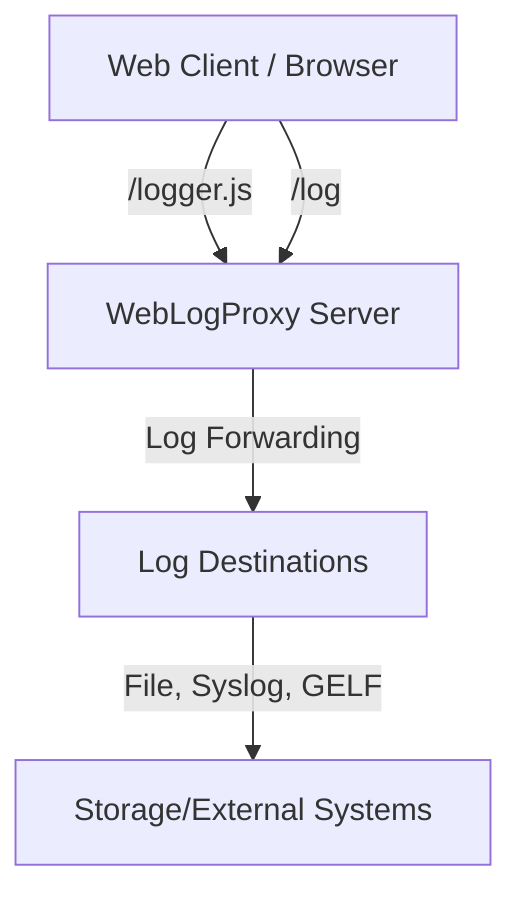
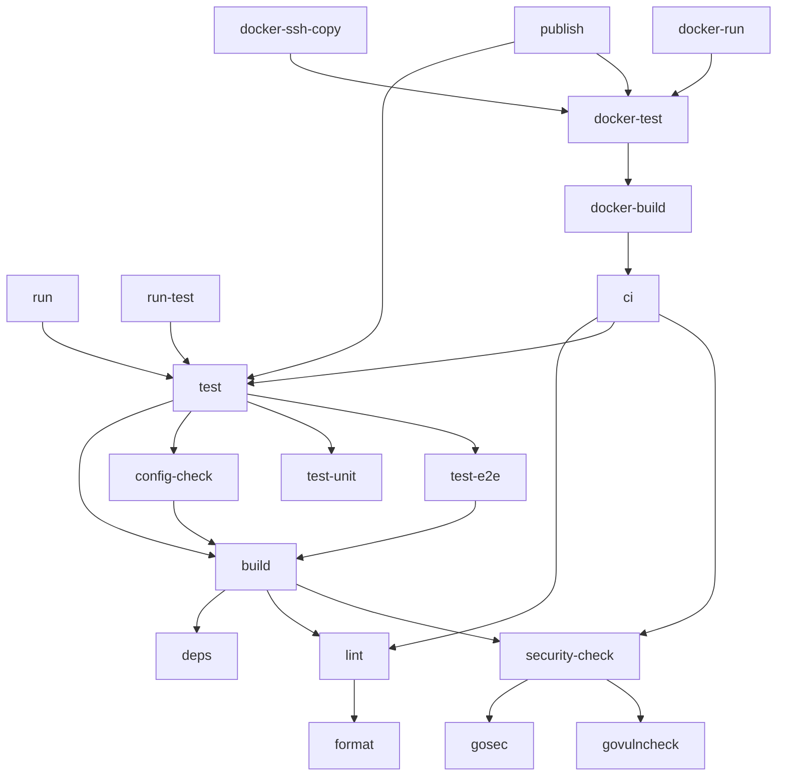

# WebLogProxy

[](https://github.com/orgoj/weblogproxy/releases/latest)
[](https://github.com/orgoj/weblogproxy/actions/workflows/ci.yml)

[➡️ See CHANGELOG.md for recent changes](./CHANGELOG.md)

WebLogProxy is a flexible and secure client-side log collection service that collects and forwards JavaScript logs from web applications to various destinations (files, GELF, syslog).

> **⚠️ Important: Not an HTTP Proxy**
>
> Despite the name, WebLogProxy does **NOT** proxy HTTP/HTTPS traffic between clients and servers. It is a specialized service for collecting client-side JavaScript logs and forwarding them to logging backends. WebLogProxy is designed to run **behind** a reverse proxy (nginx, Cloudflare, etc.), not to act as one.

## Features

* **Multiple Logging Destinations**: Configure multiple destinations for logs, including files, syslog servers, and GELF endpoints.
* **Rule-based Logging**: Define rules based on site ID, GTM ID, user agent, and client IP to control logging behavior.
* **Script Injection**: Inject scripts based on rules, even when logging is disabled.
* **Data Enrichment**: Add or modify log data with values from various sources (static, HTTP headers, query parameters, post data).
* **JavaScript Options**: Configure tracking of page URL and call stack trace for each log event based on rules.
* **Security**: Secure token generation and validation with configurable expiration.
* **Rate Limiting**: Protect against abuse with configurable rate limits.
* **Flexible Deployment**: Run standalone on its own domain or mount behind a reverse proxy (nginx, Cloudflare, etc.).
* **CORS Support**: Configure CORS for cross-origin requests.
* **Minimal Footprint**: Built in Go for speed and efficiency, with a small memory footprint.

### Performance Features

WebLogProxy implements several optimizations for high-throughput, low-latency logging:

* **Lock-Free Rate Limiting**: Uses `sync.Map` for concurrent per-IP rate limiting with minimal contention
* **Buffer Pooling**: Reuses JSON encoding buffers (`sync.Pool`) to reduce allocations by 40-60%
* **System Value Caching**: Caches hostname and PID to eliminate repeated syscalls (2 per log record)
* **Optimized Truncation**: Intelligent size estimation without JSON marshaling for oversized messages
* **HTTP Timeouts**: Configured timeouts prevent resource exhaustion and Slowloris attacks:
  - Read Header Timeout: 10s
  - Read/Write Timeout: 30s
  - Idle Timeout: 60s (keep-alive)
* **CORS Preflight Caching**: Reduces overhead with configurable max-age (default: 24h)
* **Message Compression**: Optional gzip/zlib compression for GELF logs
* **Log Rotation**: Automatic rotation with compression to manage disk usage
* **Automatic Rate Limiter Cleanup**: Removes inactive IP limiters after 24 hours (runs every hour)

## Quick Start

### Using Docker

```bash
# Get compose file and edit it
curl -o docker-compose.yml https://raw.githubusercontent.com/orgoj/weblogproxy/main/docker-compose.yml

# Create directories
mkdir -p config log

# Get configuration file and edit it
curl -o config/config.yaml https://raw.githubusercontent.com/orgoj/weblogproxy/main/config/example.yaml

# Run with Docker Compose
docker compose up -d
```

### Docker Usage with Custom UID/GID

By default, the Docker container runs with a non-root user with UID/GID 1000. You can customize this by setting environment variables in the docker-compose.yml file.

```yaml
environment:
  - PUID=1001
  - PGID=1001
```

This is useful for:
- Matching permissions with the host user for mounted volumes
- Running the application with the same permissions as the host user
- Ensuring logs and config files are owned by the appropriate user

### Building from Source

```bash
# Clone the repository
git clone https://github.com/orgoj/weblogproxy.git
cd weblogproxy

# Build the application
go build -o weblogproxy ./cmd/weblogproxy

# Copy and edit the configuration file
cp config/example.yaml config/config.yaml
# Edit config/config.yaml to your needs

# Run the application
./weblogproxy --config config/config.yaml
```

## Configuration

WebLogProxy is configured through a YAML configuration file. The file is divided into sections that control the server, security settings, log destinations, and log rules.

Create a new configuration file based on the example:

```bash
cp config/example.yaml config/config.yaml
```

### Dynamic Configuration Reload

Enable automatic configuration reloading without server restart:

```yaml
config_reload:
  enabled: true       # Enable dynamic config reloading
  interval: 60        # Check for config changes every 60 seconds
```

When enabled, WebLogProxy monitors the configuration file and automatically reloads it when changes are detected. Most configuration changes take effect immediately without restart.

### Application Logging Configuration

This section controls the application's own logging (stdout), not the forwarded client logs.

```yaml
app_log:
  level: "WARN"  # Minimum level to log (TRACE, DEBUG, INFO, WARN, ERROR, FATAL)
  show_health_logs: false  # Set to true to see logs for /health endpoint calls
```

### Server Configuration

```yaml
server:
  host: "0.0.0.0"  # Listen on all interfaces
  port: 8080
  mode: "standalone"  # standalone or embedded
  protocol: "http"   # Protocol for generated URLs: "http" or "https" (default: "http")
  domain: "log.example.com"  # Required for standalone mode
  path_prefix: ""  # Required for embedded mode

  # Security and access control
  health_allowed_ips:
    - "192.168.0.0/16"  # Optional list of IP or CIDR strings allowed to access the /health endpoint (default: allow all)
  trusted_proxies:
    - "192.168.0.0/16"  # List of trusted proxy IPs/CIDRs for X-Forwarded-For evaluation
  client_ip_header: "CF-Connecting-IP"  # Header to use for real client IP (e.g., CF-Connecting-IP, X-Real-IP)

  # Rate limiting and request constraints
  request_limits:
    rate_limit: 1000  # Max requests per minute per IP to /log (0 = unlimited)
                      # Uses token bucket algorithm with automatic cleanup
                      # Inactive IPs removed after 24h (cleanup runs every hour)
    max_body_size: 102400  # Max request body size in bytes (100KB)

  # CORS configuration
  cors:
    enabled: true
    allowed_origins:
      - "https://example.com"  # Must start with http:// or https://, or use "*" for all
    max_age: 86400  # Preflight cache duration in seconds (default: 86400 = 24h)

  # JavaScript configuration
  javascript:
    global_object_name: "wlp"  # JavaScript global object name (default: "wlp")
                               # Must be a valid JS identifier, not a reserved word

  # Custom headers for /logger.js response
  headers:
    Cache-Control: "public, max-age=3600"

  # Unknown route handling
  unknown_route:
    code: 200  # HTTP status code for unknown routes (default: 200)
    cache_control: "public, max-age=3600"  # Cache header for unknown routes
```

### Security Configuration

Token-based authentication with HMAC-SHA256 signatures:

```yaml
security:
  token:
    secret: "your-secret-key-at-least-32-chars-long"  # Min 32 characters, avoid weak/default values
    expiration: "24h"  # Token validity duration (e.g., "10m", "1h", "24h", "7d")
```

**Security Notes:**
- Tokens use HMAC-SHA256 signatures (not JWT format)
- Constant-time comparison prevents timing attacks
- Token validation includes rate limiting to prevent brute-force attacks
- Secret must be at least 32 characters and not a weak/default value

Note: User-Agent is not included in logs by default. If you need it, add it explicitly via `add_log_data` configuration:

```yaml
log_destinations:
  - name: "file1"
    type: "file"
    path: "log/access.log"
    format: "json"
    add_log_data:
      - name: "user_agent"
        source: "header"
        value: "User-Agent"
```

### Security best practices
- Always configure your reverse proxy (CDN, WAF, LB) to overwrite the chosen header with the real client IP and never forward it from the client.
- Only trust `X-Forwarded-For` if the immediate sender is in your trusted proxy list.
- If you use multiple proxies, ensure only the last one sets the trusted header and all others are in trusted_proxies.
- Never use multiple headers for IP extraction (preference order is defined by config).

#### Cloudflare
- Set `client_ip_header: "CF-Connecting-IP"` and add all Cloudflare IP ranges to `trusted_proxies`.
- See https://www.cloudflare.com/ips/ for up-to-date IP ranges.

#### Nginx
- Use the [real_ip module](https://nginx.org/en/docs/http/ngx_http_realip_module.html) and set `X-Real-IP`.
- Set `client_ip_header: "X-Real-IP"`.

#### AWS ELB/ALB
- Set `client_ip_header: "X-Forwarded-For"` and add ELB IPs to `trusted_proxies`.

If you are unsure, leave `client_ip_header` empty and rely on `X-Forwarded-For` with a properly configured trusted proxy list.

## API Endpoints

The server provides the following endpoints:

* **GET /logger.js**: Returns a JavaScript for client-side logging. Requires `site_id` parameter, optional `gtm_id`.
* **POST /log**: Receives log data from the client. Requires a valid token from /logger.js.
* **GET /health**: Simple health check endpoint.

## /logger.js Endpoint

The `/logger.js` endpoint is the entry point for the logging system. It returns a JavaScript file that sets up the logging infrastructure in the client's browser. The returned JavaScript has two possible behaviors:

* **When Logging is Enabled**: Returns a full-featured JavaScript that includes a token, configured log URL, and all necessary functionality for logging and script injection.

* **When Logging is Disabled**: Returns a JavaScript with a no-op function that silently ignores all calls, without any configuration object.

* **Script Injection**: Always includes the scripts configured in matching rules, even when logging is disabled. This allows for injecting tracking or other scripts independently of the logging functionality.

The logger operates invisibly in the browser with no console output, ensuring quiet operation even in production environments.

## HTML Usage Example

To use WebLogProxy in your HTML, include the following script and call the `window.wlp.log` function to log events:

```html
<script src="https://yourdomain.com/logger.js?site_id=example.com"></script>
<script>
    // Example log event
    window.wlp.log({
        event: 'button_click',
        buttonId: 'logButton',
    });
</script>
```

In this example, the `logger.js` script is included, and the `window.wlp.log` function is called to log an event. The event data is sent to the WebLogProxy server.

## Google Tag Manager Integration Example

To use WebLogProxy with Google Tag Manager, you can add a Custom HTML tag with the following code:

### GTM WebLogProxy - Load Logger
```html
<script>
(function(){
  var domain=window.location.hostname.replace(/^www\./i,'');
  var script=document.createElement('script');
  script.src='https://wlp.yourdomain.com/logger.js?site_id=' +encodeURIComponent(domain)+'&gtm_id='+encodeURIComponent({{Container ID}});
  document.head.appendChild(script);
})();  
</script>
```
### GTM WebLogProxy - Log Event
```html
<script>
  window.wlp.log({
    event: 'gtm_event',
    dataLayer: dataLayer[dataLayer.length-1],
    gtm: true
  });
</script>
```

You can also use the provided template: [gtm_tag_template.html](./gtm_tag_template.html)


## Log File Format

The log format follows the [Bunyan](https://github.com/trentm/node-bunyan) specification. Bunyan is a simple and fast JSON logging library for Node.js services.

### Core Fields

Every log record is a JSON object with the following required fields:

- `"v"`: Integer. Bunyan log format version (currently 0). Added by Bunyan, cannot be overridden.
- `"name"`: String. Logger name. Must be specified when creating the logger.
- `"hostname"`: String. Hostname of the machine. Retrieved via os.hostname() if not specified.
- `"pid"`: Integer. Process ID. Filled in automatically.
- `"level"`: Integer. Log level (see below). Added by Bunyan, cannot be overridden.
- `"time"`: String. ISO 8601 timestamp in UTC. Added by Bunyan, can be overridden.
- `"msg"`: String. Log message. Required for every log call.

### Log Levels

Bunyan uses the following numeric log levels:

- `10`: TRACE
- `20`: DEBUG
- `30`: INFO
- `40`: WARN
- `50`: ERROR
- `60`: FATAL

### Optional Fields

- `"src"`: Object. Source code location info. Added automatically if "src: true" is configured. Not recommended for production use.
- `"err"`: Object. Error object with stack trace.
- `"req"`: Object. HTTP request details.
- `"res"`: Object. HTTP response details.

### Example JSON Format

```json
{
  "v": 0,
  "name": "weblogproxy",
  "hostname": "server1",
  "pid": 12345,
  "level": 30,
  "time": "2024-03-14T12:34:56.789Z",
  "msg": "Processing request",
  "site_id": "site1",
  "user_id": "user123"
}
```

### Text Format

For human-readable logs, the text format follows this pattern:

```
[2024-03-14T12:34:56.789Z] INFO: Processing request (site_id=site1, user_id=user123)
```

For viewing and analyzing log files, we recommend using [lnav](https://lnav.org/), a powerful log file navigator that provides:
- Syntax highlighting for JSON
- Automatic log format detection
- SQL-like querying capabilities
- Timeline view
- Search and filtering

Example usage with lnav:
```bash
# View logs in real-time
lnav -f /path/to/log/*.log

# Search for specific events
lnav -c ':filter-in msg =~ "error"'

# Query logs using SQL
lnav -c ':sql SELECT time, msg FROM log WHERE level >= 50'
```

## Rule Processing Logic

The rule processor follows these key principles:

1. Rules are processed in order from first to last
2. Disabled rules are completely skipped
3. Rules with `continue: true`:
   - Only accumulate values (scripts, addLogData)
   - Do NOT affect logging decision
   - Do NOT affect target destinations
4. Rules with `continue: false` (or not set):
   - If enabled and matching, determine final logging decision
   - Set target destinations
   - Stop further rule processing
5. If no enabled non-continue rule matches:
   - Logging is disabled (`ShouldLogToServer: false`)
   - No target destinations are set
   - Accumulated values from continue rules are still available

### Rule Configuration Options

Each rule in `log_config` supports the following options:

**Matching Conditions:**
```yaml
log_config:
  - condition:
      site_id: "example.com"           # Match specific site
      gtm_ids: ["GTM-XXXXXX"]          # Match specific GTM containers
      user_agents: ["*Chrome*"]        # Glob patterns for user agent matching
      ips: ["192.168.1.0/24"]          # IP addresses or CIDR ranges
      headers:                         # Match HTTP headers
        X-Custom-Header: "value"       # String value (exact match)
        X-Required-Header: true        # true = header must exist
        X-Excluded-Header: false       # false = header must NOT exist
```

**Rule Behavior:**
```yaml
    enabled: true                      # Enable/disable this rule
    continue: false                    # If true, accumulate values but continue processing
    log_script_downloads: true         # Log /logger.js downloads (useful for analytics)
    log_destinations: ["file1", "gelf1"]  # Route logs to specific destinations (optional)
```

**JavaScript Configuration:**
```yaml
    javascript_options:
      track_url: true                  # Include page URL in each log event
      track_traceback: true            # Include JavaScript call stack in each log event
```

**Data Enrichment:**
```yaml
    add_log_data:
      - name: "environment"
        source: "static"               # static, header, query, post
        value: "production"
      - name: "user_agent"
        source: "header"
        value: "User-Agent"            # Header name to extract
```

**Script Injection:**
```yaml
    script_injection:
      - url: "https://analytics.example.com/script.js"
        async: true
        defer: false
      - url: "/local-script.js"        # Relative URLs supported
        async: false
        defer: true
```

**Notes:**
- `javascript_options.track_url` adds the current page URL to log events
- `javascript_options.track_traceback` captures JavaScript call stack for debugging
- `log_script_downloads` creates log entries when `/logger.js` is requested
- Header matching supports exact string values, `true` (exists), or `false` (doesn't exist)
- User agent patterns support glob wildcards (`*`, `?`)

## Log Destinations

WebLogProxy supports multiple log destination types to give you flexibility in how and where you store your logs:

### File Logger
Writes logs to a local file with configurable path, format, and rotation settings.

**Configuration Example:**
```yaml
log_destinations:
  - name: "file1"
    type: "file"
    enabled: true
    path: "log/access.log"
    format: "json"  # "json" or "text"
    max_message_size: 4096  # Optional: Max message size in bytes (default: 4096)
    rotation:
      max_size: "100MB"    # Size-based rotation (supports K, KB, M, MB, G, GB)
      max_age: "7d"        # Time-based rotation (supports m, h, d, w)
      max_backups: 10      # Number of old files to keep
      compress: true       # Compress rotated files with gzip
```

### Syslog
Forwards logs to a syslog server for centralized logging.

### GELF Logger
Sends logs to Graylog servers using the GELF (Graylog Extended Log Format) protocol. Supports both UDP and TCP transport protocols.

**Configuration Example:**
```yaml
log_destinations:
  - name: "graylog"
    type: "gelf"
    enabled: true
    host: "graylog.example.com"        # Graylog server address
    port: 12201                        # Graylog server port
    protocol: "udp"                    # Protocol: "udp" or "tcp" (default: "udp")
    compression_type: "gzip"           # Compression: "gzip", "zlib", or "none" (default: "none")
    max_message_size: 8192             # Optional: Max size in bytes (default: 8192 for UDP, unlimited for TCP)
```

**Notes:**
- UDP is faster but may drop messages under high load
- TCP is more reliable but slightly slower
- Compression only works with UDP protocol
- Message size limits: file (4096 bytes), GELF UDP (8192 bytes), GELF TCP (unlimited)
- Messages exceeding limits are automatically truncated using intelligent size estimation

## Architecture Overview



- **Web Client**: Loads logger.js and sends logs via HTTP.
- **WebLogProxy Server**: Handles log ingestion, rule processing, enrichment, security, and forwards logs.
- **Log Destinations**: Configurable outputs (file, syslog, GELF, etc.).

## Security Features

WebLogProxy implements multiple layers of security:

### Authentication & Authorization
- **Token-based Authentication**: HMAC-SHA256 signed tokens (not JWT) with configurable expiration
- **Constant-time Comparison**: Prevents timing attacks during token validation
- **Token Validation Rate Limiting**: Protects against brute-force token attacks
- **IP-based Access Control**: Restrict `/health` endpoint to specific IPs/CIDRs

### Input Protection
- **Input Validation & Sanitization**: All incoming data validated with:
  - ID validation: `^[a-zA-Z0-9_-]+$` pattern (no dots to prevent path traversal)
  - String sanitization: removes non-printable characters
  - Recursive depth limits (max: 10 levels)
  - Maximum key/value lengths enforced
- **Request Size Limits**: Configurable maximum body size (default: 100KB)
- **Rate Limiting**: Per-IP token bucket algorithm with automatic cleanup

### Network Security
- **CORS Configuration**: Strict origin validation (must start with http:// or https://)
- **Trusted Proxy Support**: Secure real IP detection from `X-Forwarded-For` and custom headers
- **Security Headers**: Automatically applied to all responses:
  - `X-Content-Type-Options: nosniff` (prevents MIME sniffing)
  - `X-Frame-Options: DENY` (prevents clickjacking)
  - `X-XSS-Protection: 1; mode=block` (legacy XSS protection)
  - `Strict-Transport-Security: max-age=31536000; includeSubDomains` (when TLS detected)

### Operational Security
- **Secret Redaction**: Sensitive values masked in error messages and logs
- **Timeout Protection**: Prevents Slowloris and resource exhaustion attacks:
  - Read Header Timeout: 10s
  - Read/Write Timeout: 30s
  - Idle Timeout: 60s
- **Error Handling**: Generic error messages prevent information leakage
- **Audit Logging**: Unauthorized access attempts logged with IP addresses

### Data Protection
- **Separation of Destinations**: Route logs to different backends, isolating sensitive data
- **Message Truncation**: Oversized messages safely truncated to prevent resource exhaustion

### TLS/SSL
WebLogProxy is designed to run behind a reverse proxy (nginx, Cloudflare, AWS ALB, etc.) that handles TLS termination. It does not implement native TLS support.

## Development

### Mise Tasks

This project uses [Mise](https://mise.jdx.dev/) for task automation. Below is a list of all available tasks, their descriptions, and a dependency graph. Use these tasks to build, test, lint, and manage the project efficiently.

#### Task List (Alphabetical)

| Task Name             | Description                                      |
|----------------------|--------------------------------------------------|
| build                | Build the weblogproxy binary executable          |
| ci                   | Run all CI checks (lint, test, security)         |
| config-check         | Validate application configuration file          |
| deps                 | Download and tidy Go dependencies                |
| docker-build         | Build the Docker image                           |
| docker-run           | Run the Docker container                         |
| docker-ssh-copy      | Deploy Docker image to remote server via SSH      |
| docker-test          | Test Docker image and functionality              |
| format               | Format all Go code recursively                   |
| gosec                | Run gosec security scan                          |
| govulncheck          | Run govulncheck vulnerability scan               |
| install-sec-tools    | Install or update security tools (gosec, govulncheck) |
| lint                 | Run Go linters                                   |
| publish              | Publish a new version                            |
| run                  | Run weblogproxy with example configuration       |
| run-test             | Run weblogproxy with test configuration          |
| security-check       | Run all security checks                          |
| test                 | Run all tests                                    |
| test-e2e             | Run end-to-end tests only                        |
| test-unit            | Run unit tests only                              |
| version-bump-dev     | Set version to -dev and prepare [Unreleased] changelog section |
| version-bump-release | Bump version for release and update changelog    |

#### Task Dependency Graph




## Versioning and Release Process

WebLogProxy uses a two-phase versioning process:

- **Development version:**
  - Run `mise run version-bump-dev`.
  - Sets the version with the `-dev` suffix (e.g., `1.2.3-dev`) in `internal/version/version.go`.
  - Prepares the `[Unreleased]` section in `CHANGELOG.md`.
  - All builds and Docker images will be marked as dev.

- **Release version:**
  - Run `mise run version-bump-release -- -y patch` (or `minor`/`major`).
  - Removes the `-dev` suffix from the version, moves the contents of `[Unreleased]` to a new section with the version number and date in the changelog.
  - All builds and Docker images will be marked as release.

This ensures it is always clear whether a build is a development or production build. Everything is fully automated and reflected in the changelog.

## Contributing

Contributions are welcome! Please open an issue or submit a pull request.

## License

This project is licensed under the MIT License - see the LICENSE file for details.

## Origin of the Program

WebLogProxy was created because I needed to log events from Google Tag 
Manager. I developed the entire project using the Cursor IDE, without 
any prior experience in the Go programming language. I didn't write a 
single line of code and was just learning to use the editor.

### Code estimation by [scc](https://github.com/boyter/scc):

v0.10.2

```bash
$ docker run --rm -it -v "$PWD:/pwd"  ghcr.io/boyter/scc:master scc /pwd
───────────────────────────────────────────────────────────────────────────────
Language                 Files     Lines   Blanks  Comments     Code Complexity
───────────────────────────────────────────────────────────────────────────────
Go                          29      7573      704       700     6169       1154
Shell                       15      1057      174       181      702        113
YAML                         8       673       59       115      499          0
Markdown                     4       840      134         0      706          0
JSON                         2        25        0         0       25          0
Docker ignore                1        43       10        11       22          0
Dockerfile                   1        77       20        20       37          7
JavaScript                   1        69        6         3       60         11
Plain Text                   1        21        4         0       17          0
TOML                         1       138       24         1      113          2
───────────────────────────────────────────────────────────────────────────────
Total                       63     10516     1135      1031     8350       1287
───────────────────────────────────────────────────────────────────────────────
Estimated Cost to Develop (organic) $250,822
Estimated Schedule Effort (organic) 8.13 months
Estimated People Required (organic) 2.74
───────────────────────────────────────────────────────────────────────────────
Processed 348353 bytes, 0.348 megabytes (SI)
───────────────────────────────────────────────────────────────────────────────
```
